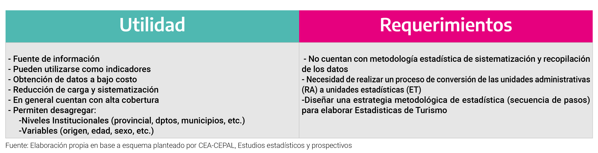
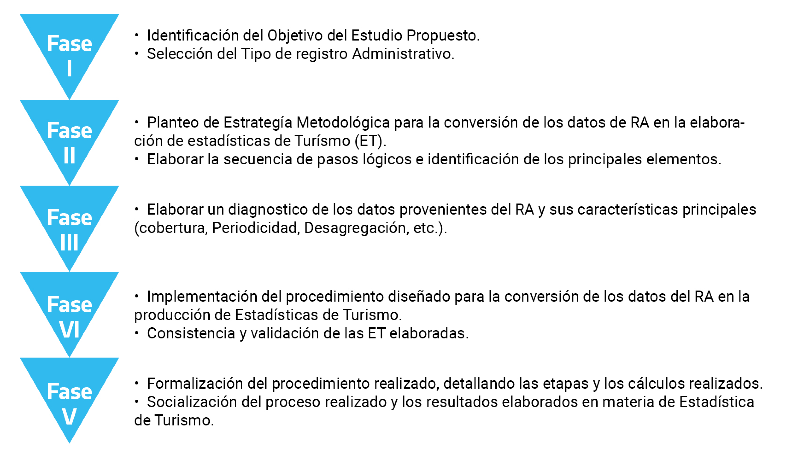

# **Los registros administrativos**

El objetivo de los apartados siguientes consiste en abordar con profundidad la importancia y la metodología de utilización de los Registros Administrativos como insumo clave para la elaboración de estadísticas de Turismo y, a la vez, proponer una reflexión compleja respecto de los usos potenciales de los mismos.

## ¿Qué son?

En el marco de la generación de estadísticas básicas, una de las principales fuentes de información proviene de los registros administrativos (`RA`). Según la evidencia y las experiencias relevadas, actualmente es escasa su utilización como insumo para la elaboración y producción de estadísticas tendientes a la medición del Turismo.

La explotación de los RA se posiciona como una herramienta para la producción de estadísticas de Turismo a nivel nacional, provincial y/o departamental. Éstos pueden ser complementados con el resto del sistema de información de las distintas unidades geográficas, comprendido por otros operativos estadísticos.

En la literatura especializada no se encuentra una definición universal respecto de qué es y qué se entiende por registro administrativo. Pese a esto, resulta importante analizar algunas de las definiciones encontradas:

> "...todo registro resultante de necesidades fiscales, tributarias u otras, creado con la finalidad de viabilizar la administración de los programas de gobierno o para fiscalizar el cumplimento de obligaciones legales de la sociedad. Para su utilización con fines estadísticos es preciso evaluar su base conceptual y metodológica, clasificaciones, cobertura alcanzada, variables investigadas, calidad de las respuestas, procesamiento de los datos y frecuencia de disponibilidad de ellos..." [@cepal2003].

> "...aquellos registros de carácter administrativo y operativo, son procedimientos que utilizan las instituciones para registrar datos de las actividades propias de su función, muchas de ellas relacionadas con la oferta de un servicio público, otras que identifican a usuarios del Estado, y algunas que se derivan de las actividades realizadas con empresas e instituciones nacionales e internacionales, la cual no necesariamente coincide con los fines estadísticos, por lo que requiere un tratamiento especial para su utilización..." [@inei2004].

A partir de lo señalado anteriormente surge que el RA no es una fuente de origen estadístico propiamente dicho, ya que su finalidad es administrativa, y además, su propósito es servir para un control normativo. Es decir, registra un evento o acto individual referido a un individuo u objeto y lo afecta directamente.

Por ejemplo, en una operación de compra-venta de un objeto se emite una factura, lo que implica que se registra un evento normativo con fines fiscales; al solicitar un empleo se completa una planilla para evaluar el perfil del solicitante; al faltar una norma de tránsito se levanta una boleta de citación o una multa que deberá ser cancelada, etc. En conclusión, ninguno de estos eventos es propiamente estadístico, sin embargo, se convierte en una fuente de información estadística luego de ser tratada mediante procedimientos convenientes.

De manera genérica se plantea aquí la definición de los `RA` como:

> "Aquella información que surge de los procedimientos administrativos y/o operativos que desarrollan y utilizan las instituciones (públicas o privadas) como método de registro de las diferentes actividades (turísticas y/o no turísticas) realizadas."

En base a las experiencias internacionales recopiladas, se da cuenta de los requerimientos que deben cumplir los procesos de diseño, recolección, producción y difusión de los `RA` [@dane2010a]. Éstos deben responder a criterios de calidad estadística, como lo son:

\* **Credibilidad**: Se basa en la confianza que tienen los usuarios sobre el proceso estadístico del registro administrativo. Evalúa los «estándares estadísticos apropiados», es decir, políticas y prácticas objetivas para el diseño, recolección, almacenamiento, procesamiento y difusión de datos estadísticos [@ine2007].

\* **Oportunidad**, temporalidad y accesibilidad: Es el período en el que la información es de valor y se puede actuar o tomar decisiones acorde con ella. Estrechamente relacionada a la oportunidad está la puntualidad, que implica la existencia de una agenda de publicación y refleja el grado de cumplimiento de ella [@oecd2003].

Según la Organización para la Cooperación y Desarrollo Económicos (OECD), la información estadística puede considerarse de calidad en la medida en que se encuentre disponible en el momento en que aún es relevante para el seguimiento y evaluación, y/o la toma de decisiones respecto al fenómeno que estudia o que es objeto de medición.

\* **Accesibilidad**: Evalúa la rapidez de localización y el acceso dentro de la organización. La accesibilidad incluye la conveniencia de la manera en que los datos están disponibles, los medios de divulgación, la disponibilidad de metodologías, metadatos, datos y servicios de apoyo al usuario [@oecd2003].

Es necesario tener en cuenta que la forma en que se presentan los datos a los usuarios sea en forma clara y comprensible, lo que implica estrategias de difusión adecuadas e imparciales y si el usuario tiene acceso a metadatos actualizados, sin ningún tipo de restricción. Además, es necesario contar con sistemas de apoyo a los usuarios que utilizan los datos.

En términos de la CEPAL, este criterio contempla las *«condiciones físicas en que los usuarios pueden obtener los datos: dónde y cómo pedirlos, tiempo de entrega, política clara de precios, formatos de disponibilidad, otros*»[@cepal2003].

\* **Pertinencia o relevancia**: Es una medida cualitativa del valor aportado por la información. El valor está directamente relacionado con el grado de utilidad para satisfacer el propósito por el cual la información fue buscada o solicitada. Depende de la cobertura de los tópicos requeridos y del apropiado uso de conceptos. La medición de la relevancia de un producto estadístico requiere de la identificación de su grupo de usuarios y sus necesidades [@oecd2003]. Los datos producidos por los `RA` tienen múltiples usos y usuarios que pueden cambiar con el tiempo.

Asimismo, cada uno de los múltiples `RA`, poseen características propias respecto de la forma en que se fueron sistematizando y registrando. En efecto, para su aprovechamiento como fuente secundaria para la producción de estadísticas metodológicamente elaboradas, resulta posible identificar diferentes aspectos respecto de la utilidad y los requerimientos que posean cada uno.

Entre los principales elementos respecto de la utilidad de los mismos, se puede destacar que:

i) son una fuente de información importante y disponible;

ii) pueden utilizarse como indicadores de evolución (aunque con ciertas limitaciones que se profundizan posteriormente en este documento), y a la vez, como insumos para la elaboración de estadísticas;

iii) la obtención de dicha información posee bajo y/o nulo costo; por lo general;

iv) cuentan con una alta cobertura y la información suministrada permite generar distintas desagregaciones, como por ejemplo, según niveles institucionales (provincial, departamental y/o municipal) y tipos de variables (sexo, edad, etc.).

De manera complementaria, los requerimientos claves que se deberían contemplar para su utilización consisten en el análisis de las limitaciones de dicha fuente, ya que no cuentan con una metodología estadística que sistematice y recopile la información. Tanto para su utilización como insumo y/o para la elaboración de indicadores estadísticos se requiere, por lo general, un proceso de conversión que transforme las unidades administrativas en unidades estadísticas y, a la vez, en dicho proceso, se requiere diseñar y desarrollar una metodología con la secuencia lógica de diferentes pasos estadísticos.

En la figura que se presenta a continuación, se puede dar cuenta de las utilidades y los requerimientos que la utilización de los `RA` presenta.

```{r registrosadministrativos, echo=FALSE, fig.cap="Utilidad y requerimientos para el uso de los Registros Administrativos" }

```

El análisis que se haga de los datos generados a partir de los `RA` estará condicionado por la forma en que estas cuestiones sean encaradas y solucionadas tanto desde la propia institución que genera los datos como por el organismo que los utiliza con fines estadísticos. En efecto, se deben contemplar ciertos recaudos al momento de la utilización de los datos, la forma en que se los extrapole, los ponderadores que se utilicen, etc. con el propósito de procurar que las cifras obtenidas de las fuentes secundarias sean lo más representativas de la realidad que se procura captar.

El fortalecimiento de los `RA` para fines estadísticos constituye un proceso que busca desarrollar la base metodológica y conceptual, la oportunidad de recolección, las variables y la disponibilidad de la información recolectada, a través de una metodología que permita potencializarlos como fuente de información estadística para la toma de decisiones y la formulación de planes, proyectos y políticas públicas destinadas al sector turístico.

En este sentido, a fin de que un registro administrativo sea utilizado para un análisis estadístico se deberán contemplar, al menos, los siguientes criterios: la base metodológica, la clasificación con la que cuenta el registro, la cobertura geográfica, la calidad de la registración de los datos que posee, la temporalidad y oportunidad y los medios por los cuales se puede disponer de la información [@inegi2006].

Como ya se ha mencionado, desarrollar una metodología válida y clara es fundamental para una correcta utilización de los `RA` en la confección de estadísticas del turismo (ET). Por ende, se reconoce la importancia que posee la confección de un herramental técnico a fin de facilitar su utilización.

Con el objetivo de proponer las pautas para la producción de estadísticas, en base a los `RA`, en la **Figura N°2** se presenta un conjunto de etapas y/o fases para la correcta conversión de la información almacenada en los mismos tal que permitan cuantificar el objetivo buscado. En la siguiente figura se presenta una posible secuencia lógica de estas fases:

```{r Fases, echo=FALSE, fig.cap="Fases de la conversión de datos provenientes de registros administrativos en información estadística" }

```

En primer lugar, en la fase I se requiere definir la población[^registros_administrativos-1] objetivo y se debe contar con la máxima claridad sobre el objetivo general del estudio propuesto, ya que éste permitirá orientar los pasos subsiguientes en la correcta explotación del `RA`.

[^registros_administrativos-1]: Es el conjunto de individuos de referencia sobre el que se realizan las observaciones para luego obtener conclusiones (hacer inferencias).

En la fase II, se plantea que la definición de dicha población requiere contemplar los siguientes elementos:

I)  **Unidad Administrativa**: está compuesta por los elementos registrados en cada uno de los `RA`.

II) **Alcance**: se refiere a la ubicación espacial y geográfica del estudio (provincial, departamental y/o municipal).

III) **Tiempo**: define el intervalo de tiempo en el cual se realiza la investigación (mensual, semanal, quincenal, etc.).

IV) **Marco Muestral**[^registros_administrativos-2]: cada uno de los `RA` podría utilizarse como marco muestral para una posterior expansión en caso de realización de alguna encuesta.

[^registros_administrativos-2]: Un marco muestral se define como una lista que contiene el conjunto de unidades (población) del cual se seleccionará la muestra a partir de la cual se realizará la inferencia estadística.

En tercer lugar, en la fase III se deberá elaborar un diagnóstico respecto a qué tipo de datos e información suministra y almacena cada uno de los múltiples `RA`, como así, las características principales.

La fase IV, consiste en la implementación del proceso de conversión, mediante el cual se explotará la información de los registros para la producción de estadísticas de turismo y las tareas de consistencia y validación de las ET elaboradas.

Por último, la fase V resulta crucial debido a que se refiere, por un lado, a la formalización del procedimiento realizado, detallando las diferentes etapas y los cálculos exactos, y por otro lado, a la socialización y discusión de las estadísticas de turismo elaboradas.

En conclusión, no sólo resulta importante la selección del `RA` a utilizar para el análisis estadístico del sector, sino que también se deben considerar las diferentes etapas previamente planteadas para obtener información estadística robusta y atinada.

## Situación Internacional

La Organización Mundial del Turismo (OMT) recomienda la utilización de los `RA` como una de las fuentes secundarias principales, junto a las encuestas, para la producción y elaboración de estadísticas tendientes a la medición del Turismo.

En este sentido, en línea con lo comentado anteriormente, se resalta el hecho de que las estadísticas basadas en `RA` suelen ser subproductos de los procesos administrativos. Asimismo, enuncian que con frecuencia se basan en operaciones continuas, por lo que pueden ser una fuente útil de estadísticas constantes y longitudinales. Sin embargo, se reconoce el hecho de que los `RA` también pueden tener algunos inconvenientes, como una cobertura y contenido limitados, conceptos y definiciones inflexibles, falta de exhaustividad, incoherencias y un acceso limitado debido a restricciones legales o administrativas [@omt2010].

A pesar de reconocer la importancia que los `RA` poseen para la confección de información estadística, no suelen hallarse recomendaciones en cuanto al procedimiento metodológico a aplicar en la búsqueda de la conversión de la información administrativa en información estadística. Por tanto, cada país se encuentra a cargo de la confección del procedimiento metodológico a aplicar a fin de realizar una óptima conversión de la información y aquí radica la importancia del presente documento.

En materia de experiencias internacionales, a modo de un sintético estado de situación, se hace referencia a experiencias denominadas como ¨buenas prácticas¨ en los usos y utilización de los `RA`.

Un caso que resulta relevante mencionar es el de España, debido a la utilización exhaustiva de los `RA` como insumo para la producción de estadísticas de Turismo. Los estudios en los que se centran, muchos de ellos realizados en la actualidad por el Instituto Nacional de Estadística (INE), son los siguientes:

-   El análisis de los `RA` empleados en la Encuesta de Movimientos Turísticos en Fronteras (Frontur).

-   El análisis de la información de vuelos -y pasajeros internacionales que Aeropuertos Españoles y Navegación Aérea (AENA).

-   El análisis del registro de entradas y salidas en el Museo del Prado.

-   El análisis de los registros de la Seguridad Social sobre el empleo en las actividades turísticas.

Por último, en Finlandia, como en varios otros países de Europa, la utilización de los `RA` se ha expandido en forma sistemática, hasta tal punto que en muchas situaciones reemplaza a los censos tradicionales. Es decir, debido a la calidad de sus `RA` en estadísticas vitales y migraciones ya no precisan la realización de censos de población para determinados estudios estadísticos. Si bien no constituye un ejemplo ligado al turismo, este caso da cuenta de cuán importante son (y, más aún, pueden ser) los `RA` bien aprovechados.

## Situación Nacional

En el marco de la experiencia nacional, resulta relevante destacar la utilización de `RA` por una de las principales encuestas nacionales de turismo, la Encuesta de Turismo Internacional (ETI). Este operativo utiliza como marco muestral a la base de datos de la Dirección Nacional de Migraciones (DNM). Es decir, posteriormente a la ejecución de las encuestas se verifican los registros de la DNM en cuanto a cantidad de visitantes que ingresan y residentes que egresan, clasificándolos según origen y destino respectivamente. Seguidamente se encuesta a una muestra estratificada, previamente definida, tomando como base a dicho registro de la DNM y, finalmente, los resultados se expanden al total del marco muestral.

Asimismo, desde el Ministerio de Turismo y Deportes de la Nación (MINTURDEP), se recopilan cifras sobre la cantidad de visitantes a los Parque Nacionales, dependientes de la Administración Nacional de Parques, ubicados en las distintas jurisdicciones provinciales. En su mayoría estos datos se encuentran clasificados por nacionalidad de origen (argentinos/extranjeros). Dentro de la última variable, en varios casos, los argentinos se encuentran diferenciados según tengan origen o no en la provincia en donde se encuentra el Parque Nacional en cuestión. Con esta información, el MINTURDEP elabora estimaciones estadísticas sobre visitantes a un subconjunto de los distintos parques nacionales, constituidos por una selección de 35 parques que cuentan con métodos sistemáticos de registro de visitas de las 48 áreas protegidas nacionales existentes. Es decir, no se cuenta con información sobre la totalidad de los parques nacionales existentes, no obstante, lo importante es que gracias a las cifras recopiladas se posibilita la confección de estadísticas importantes a muy bajo costo, de manera sistemática y confiable debido a que los datos recibidos poseen una gran robustez gracias a la metodología mediante la cual se recaban históricamente.

Por otro lado, a nivel provincial, departamental y/o municipal se utilizan múltiples `RA` tanto desde la perspectiva de la oferta como de demanda. Aun así, existe subexplotación de la información existente y, en segundo lugar, falencias con el relevamiento y procesamiento de la información.

A continuación, se listan los puntos más comunes en torno a las falencias mencionadas a fin de realizar una óptima utilización de los `RA`:

-   Sub-explotación: en varios casos, no se ha reconocido la existencia de la posibilidad de extracción de mayor cantidad de datos de las fuentes secundarias. A su vez, en muchas situaciones se elaboran sistemáticamente `RA` sin fines de ser utilizados posteriormente como insumos para la producción de estadísticas.

-   Escaso procesamiento estadístico: como ya se ha mencionado, los `RA` no se encuentran diseñados específicamente para su explotación estadística, es decir, no suelen estar sometidos a validaciones o correcciones no estadísticas de errores. En efecto, se requiere de un procesamiento de conversión adecuado de los datos recibidos para luego poder utilizarlos en un estudio de tipo estadístico.

-   Falta de actualización de datos: es usual que a partir de `RA` se realizan estudios muestrales a fin de calcular coeficientes, para posteriormente llevar a cabo análisis sobre el universo bajo estudio. Éstos requieren ser actualizados, cada determinado período de tiempo, a fin de reflejar en forma más fehaciente la realidad del sector. Por ejemplo, si en el año 2013 se estiman coeficientes sobre la cantidad de individuos por automóvil que entran a una cierta localidad, éste debe ser recalculado cada una determinada cantidad de años, de acuerdo a los cambios que caben esperarse. Esto se debe a que la situación del sector turístico no es uniforme a lo largo de los años. Con el paso del tiempo podrían registrarse variaciones, positivas y/o negativas respecto del flujo turístico hacia las distintas localidades, aun cuando se mantenga constante el flujo vehicular, pero la cantidad de personas promedio podría disminuir.

-   Falta de incorporación de la estacionalidad del sector en los estudios estadísticos: los coeficientes también deben ser ajustados según el momento turístico del año en cada jurisdicción. En todas las provincias, departamentos y/o municipios, se pueden reconocer sub-periodos de mayor o menor afluencia turística (temporada alta/baja), dentro de un mismo año, y cada uno merece un tratamiento especializado. Al reconocer la estacionalidad y la elasticidad frente a las condiciones socioeconómicas que posee el sector turístico, se resalta la importancia que la actualización de las estimaciones poseen. Así, resulta importante contar con un calendario turístico, de modo de identificarlos momentos que pertenecen a períodos de mayor o menor movimiento de visitantes.

En síntesis, se debe evaluar la posibilidad de realización de estudios sencillos y acotados ejecutados de la forma más eficiente y con el menor despliegue de recursos, que permitan luego, a partir de los datos que brinda el `RA`, realizar una estimación de las cantidades y de ciertas características de los visitantes.

En el capítulo siguiente, se presenta y propone una clasificación de los `RA`, con el propósito de orientar la identificación de cada uno de ellos según: el tipo de información que proporciona y su fuente de información, la perspectiva de oferta y demanda, según su alcance y, por último, su utilización. Todos ellos, dependiendo de los objetivos del tipo de estudio propuesto y la respectiva clasificación de los registros contemplados como insumo para la producción de estadísticas de medición del Turismo.

A partir de la información recopilada en cada una de las provincias, en cuanto a la utilización de los `RA` y en base al análisis de los avances realizados a nivel internacional sobre las metodologías puestas en marcha para el tratamiento de éstos, en el capítulo 3 y 4 se plantea, desde la perspectiva de la demanda, un esquema para la implementación de los procesos de fortalecimiento en la generación y producción de ET. Esto es posible, mediante el aprovechamiento de los `RA` recabados por las diferentes áreas informantes a nivel provincial, departamental y/o municipal de carácter público y/o privado.

\

\
\
