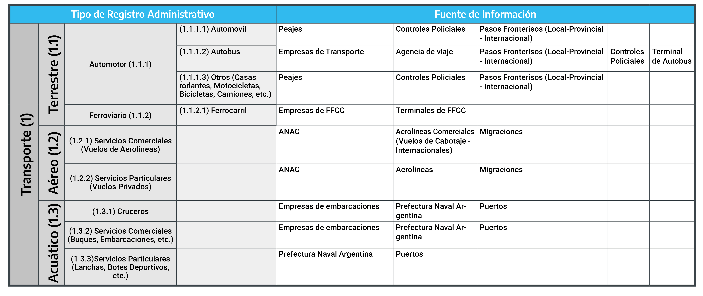
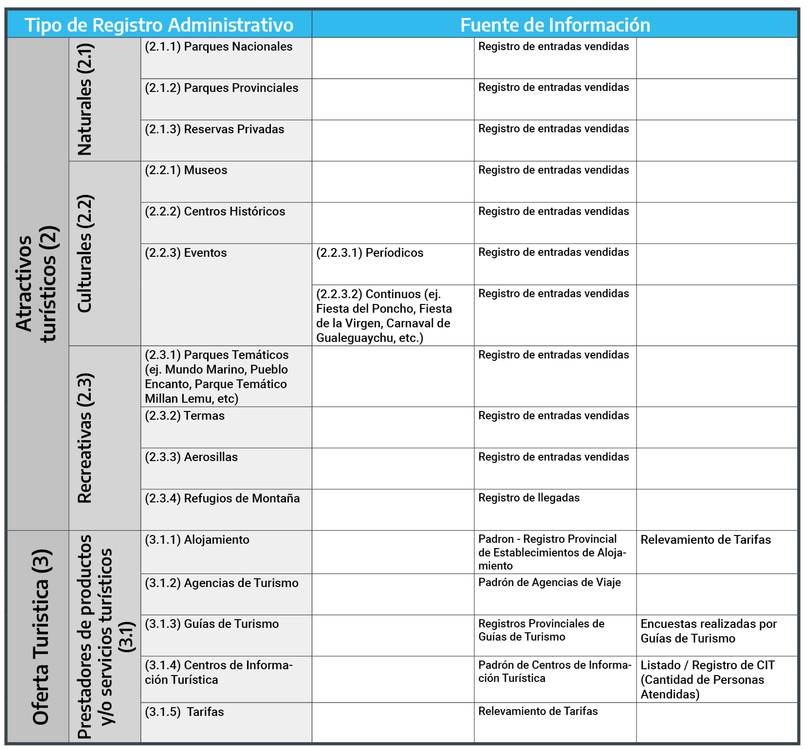

# **Clasificaciones**

Uno de los múltiples objetivos del proyecto de Armonización de las Estadísticas de Turismo en las Provincias consiste en la elaboración de un estado de situación actualizado de la recopilación y sistematización de los `RA` existentes a nivel provincial, departamental y/o municipal.

A partir de la información relevada en las jurisdicciones provinciales, se reflexiona sobre los distintos tipos de `RA` utilizados en cada una de ellas, las cuales poseen distintos grados de cobertura y confiabilidad. Los mismos se obtienen tanto de entes públicos como privados.

En primer lugar, en las provincias existe una gran cantidad de entes generadores de datos a partir de los registros de entradas y salidas por distintos medios de transporte: terrestre, acuático y/o aéreo. En general, de la información de las entradas y salidas de vehículos, dichos entes procuran estimar la cantidad de visitantes, en base a coeficientes o estimaciones indirectas.

La robustez de estos registros presenta un alto grado de disparidad entre sí, ya que mientras en algunos casos cuentan con un registro de tipo censal, como son los aeropuertos; otros son de tipo muestral, como por ejemplo, algunos controles policiales en ruta que registran las entradas y salidas de automóviles en determinados momentos. La disparidad se incrementa cuando se trata de visitantes, debido a que se ha dado cuenta de que si bien existen registros de tipo censal, al igual que el caso anterior, otros son realizados en base a ponderaciones aplicadas a las muestras de servicios de transporte mencionadas anteriormente.

Asimismo, se verifica que los organismos que calculan las estadísticas de turismo en aquellas provincias que cuentan con Parques Nacionales y/o Provinciales, reciben, con distinta periodicidad, los registros de ingresos de visitantes a los mismos. En este caso, las cifras obtenidas poseen un cierto grado de sistematicidad y confiabilidad ya que en su mayoría las cifras se obtienen a partir de los tickets vendidos y/o conteos de ingresantes. Una situación análoga ocurre con los ingresos registrados por los atractivos turísticos culturales, como ser museos y centros históricos, y los de tipo recreativos como por ejemplo: aerosillas, parques temáticos, etc.

Se da cuenta también de que algunas provincias realizan estimaciones acerca de la cantidad y utilización de las segundas viviendas existentes. Este cálculo es de gran importancia para el análisis del turismo rutinario o frecuente. Hasta el momento, sólo se ha verificado una estimación a partir de los registros provenientes de las Empresas de Servicios Públicos, más específicamente de la electricidad.
CAMBIO
Por último, se verifica la importancia que poseen aquellas fuentes secundarias que permiten obtener cifras de empleo en el sector turístico. Las mismas pueden obtenerse tanto de fuentes públicas (agencias de recaudación) o privadas (prestadores de servicios turísticos). La importancia que se les atribuye a este tipo de registros se debe a que dichos datos ofrecen un panorama de la generación de puestos laborales en el sector, lo cual implica un gran impulso económico para la provincia en su totalidad.

La clasificación de los `RA` permite elaborar diferentes perspectivas de análisis que facilitan identificar, categorizar y/o agrupar a los múltiples registros existentes. A continuación se detallan cuatro formas de clasificación respecto del objetivo de la categorización de los `RA`.

Las perspectivas de clasificación propuesta corresponden, en primer lugar, a qué tipo de información almacena y cuáles son las fuentes de información que suministran dichos registros; en segundo lugar, desde la perspectiva de oferta y/o demanda, en relación al acceso a la información; en tercer lugar, según el alcance; por último, según la utilización que se realiza de ellos.

## Según tipo de información

En primer lugar, se elaboró una tipología de clasificación que identifica el tipo de información que los diferentes `RA` almacenan y proporcionan, como así también, cuáles son las fuentes de información que suministran los respectivos `RA`. Se presentan cinco agregados desde los cuales al interior de cada uno de ellos se realizan sub-desagregaciones que procuran desarrollar analíticamente cada una de las dimensiones para la producción de estadísticas de Turismo. 

En primer lugar, el Transporte, agrupa a tres tipos: Terrestre, Aéreo y/o Acuático. 


```{r clasificaciontransporte, echo=FALSE, fig.cap="Clasificación de los registros administrativos ligados al transporte por tipo de información" }

```


En segundo lugar, los Atractivos Turísticos, contemplan a los Naturales, Culturales y/o Recreativos. Luego, en tercer lugar, la Oferta Turística (Figura \@ref(fig:clasificacionatractivos)), incluye a los prestadores y oferentes de productos y/o servicios turísticos.

```{r clasificacionatractivos, echo=FALSE, fig.cap="Clasificación de los registros administrativos ligados a los atractivos turísticos y a la oferta turística por tipo de información" }

```


En cuarto lugar, las Segundas Viviendas, únicamente debido a su especificidad propia. Por último, en quinto lugar, la cuantificación del Empleo (Figura \@ref(fig:clasificacionsegundasviviendas)), respecto del tipo de gestión que suministra la información.

```{r clasificacionsegundasviviendas, echo=FALSE, fig.cap="Clasificación de los registros administrativos ligados a las segundas viviendas y al empleo por tipo de información" }
knitr::include_graphics('imagenes/figura03C.png')
```

## Según oferta/demanda

Una segunda forma de clasificación posible de los `RA` parte de la perspectiva o enfoque desde la porción del mercado turístico de la que se brinda información. Es decir, si está ligado a la demanda(actividades, consumos, etc. realizados por los visitantes) o a la oferta (unidades productoras o prestadoras de bienes y servicios).

En efecto, desde la demanda, las unidades informantes (públicas y/o privadas) más comunes son:

-   Empresas de Peaje

-   Terminales (Ómnibus, Aéreas y/o FF.CC) -- informando sobre cantidad de visitante que ingresan y/o egresan de las unidades geográficas

-   Centros de Información Turística (CITs)

Atractivos:

**I)** Naturales (Parques Nacionales, Provinciales)

**II)** Culturales (Museos, Centros Históricos, Eventos)

**III)** Recreativos (Parques Temáticos, Termas, Aerosillas, etc.)

En cambio, desde la perspectiva de la oferta, se podría agrupar a las unidades informantes tales como:

-   Terminales (Ómnibus, Aéreas y/o FF.CC) -- informando sobre cantidad de servicios que ingresan y/o egresan a la unidad geográfica

-   Registro y/o Padrón de Establecimientos de Alojamiento Turístico (dependiente de la Provincia, Departamentos y/o Municipios)

-   Agencias de Turismo

-   Guías de Turismo.

Cabe señalar que esta distinción entre oferta y demanda no siempre resulta clara y/o tajante. Así, si se construye un padrón de hoteles con cantidad de habitaciones y tipo de servicios, se está accediendo a información que caracteriza a la oferta, pero si, además, se cuenta por ejemplo con información sobre facturación, ello resultará indicativo de la demanda. Una situación análoga puede encontrarse en el caso del transporte público (asientos o lugares disponibles y ocupados).

Por último, se encontró otras fuentes claves de información como ser la cantidad de Segundas Viviendas proveniente del Censo Nacional de Población, Hogares y Viviendas y la generación de Empleo siendo información suministrada por unidades públicas y/o privadas.

## Según alcance

En tercer lugar, resulta relevante considerar el "alcance" de los múltiples `RA`, respecto de contemplar claramente e identificar qué tipo de información sistematizan y almacenan cada uno de los mismos.

En efecto, se podría clasificar como parcial y/o total la información proporcionada por cada uno de los registros. El alcance, deberá considerarse para la expansión de los resultados elaborados y, en base a ellos se proyectará a la población total que se procure medir y cuantificar.

Por ejemplo, se pueden encontrar `RA` de tipo parcial como ser las personas que visitaron algún atractivo turístico de una determinada provincia, ya que esta información permite visualizar sólo a una porción del universo total de visitantes, (quienes ingresan a los atractivos) que podrían arribar a dicha provincia. Por lo tanto, la información de dicho registro claramente representa sólo una porción y, por ende, si el objetivo es conocer el total de visitantes, se deberá contemplar algún proceso de conversión de forma tal que permita expandir dicho valor al total.

En cambio, entre aquellos de tipo total se pueden encontrar a los provenientes de accesos a la provincia, municipio y/o departamento, los cuales posibilitan una aproximación, con relativa significatividad, respecto de la medición del total de la afluencia turística. Por ejemplo, en una determinada provincia, los peajes y/o puestos camineros, al registrar el total de servicios (tanto privados --automóviles, camiones, motocicletas, casas rodantes, etc.-, como públicos --ómnibus-) según frecuencia y capacidad total de traslado de personas cuentan con vasta información de ingresos y egresos de las personas a dicha jurisdicción. No obstante, la limitación que presenta dicho registro, es la imposibilidad de diferenciar a los visitantes (turistas y/o excursionistas) del total de personas trasladas, para lo cual, se requerirá realizar un operativo estadístico que permita cuantificar dicha magnitud.\

## Según utilización

En cuarto lugar, interesa resaltar la importancia de contemplar la utilización de la información de los registros de manera Directa o Indirecta en el marco de la medición del Turismo.

La utilización de los `RA` se refiere a la posibilidad (o imposibilidad) de sus usos tal cual se encuentra almacenada la información de los mismos. En decir, si el mismo se utiliza tal cual fue elaborando, si se lo emplea como un insumo para un proceso de producción estadística posterior o si se lo usa para la elaboración de coeficientes de distribución, etc.

Como ya se ha señalado, la utilización de los registros en general requiere un proceso de conversión estadística, que transforme a las unidades administrativas en unidades estadísticas, lo cual sugiere una utilización indirecta de los mismos (por ejemplo, la cantidad de vehículos es un insumo para estimar la cantidad de visitantes).

Asimismo, existe la posibilidad de la utilización directa. Por ejemplo, en un Centro de Información Turística (CIT) de un departamento y/o municipio, el recuento de las personas que ingresan solicitando información, podría expresarse como la cantidad de visitantes al CIT en un momento determinado. No obstante, dicha cantidad no representa en forma directa la cantidad de visitantes a la localidad y, por lo tanto, no es metodológicamente válido, generalizar sin más dicha cantidad al total de visitantes respectivamente.

En este sentido, para la utilización de los `RA` se debe contemplar varias cuestiones previas a su explotación como fuente de información secundaria. Qué tipo de información proporciona, cómo se almacena y acumula la misma, qué tipo de procesamiento estadístico debe realizar para poder utilizarse como indicadores de medición del Turismo, entre otras.

En síntesis, las clasificaciones presentadas se proponen como una primera propuesta de ordenamiento de los diferentes `RA`, en base a la información registrada por cada uno de ellos, en el marco de las experiencias recopiladas mediante las visitas técnicas a las jurisdicciones provinciales del país.

Resulta importante destacar que, existe una subexplotación de los `RA` como fuente secundaria de información para la producción de ET. En el capítulo cuarto se presenta en detalle de manera analítica en base a la primera forma de clasificación planteada "Clasificación por tipo de Registro Administrativo".

Dicha situación se vincula directamente a la escasa articulación institucional de las áreas de producción de ET con las diferentes unidades proveedoras de dichos registros.

También, existe un reducido desarrollo de innovaciones respecto de la utilización, con criterios metodológicos, de la información de los diferentes registros con una fuerte impronta de su utilización de forma directa como indicador de medición del Turismo, cuyas limitaciones se han desarrollado previamente.

Lo que se procura proponer mediante el desarrollo de la clasificación, y en base a sus diferentes perspectivas, consiste en la toma de conciencia sobre la existencia y disponibilidad de los múltiples `RA` y el incentivo para su solicitud y posterior tratamiento estadístico con el fin de mejorar y complejizar los operativos de estadísticas en marcha, desarrollados y/o a comenzar en las diferentes jurisdicciones provinciales.
