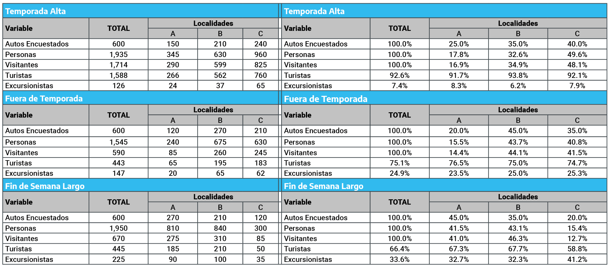
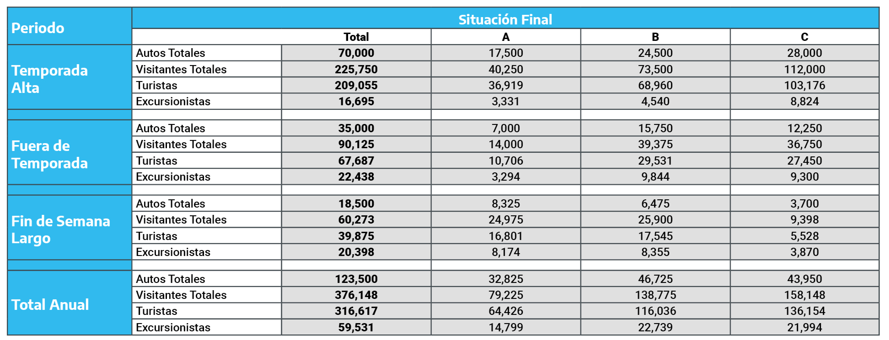
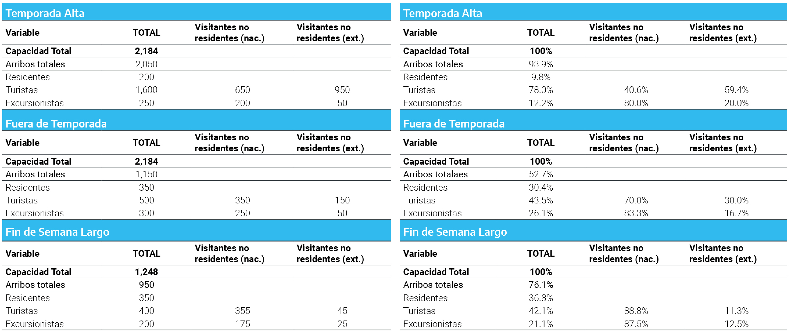
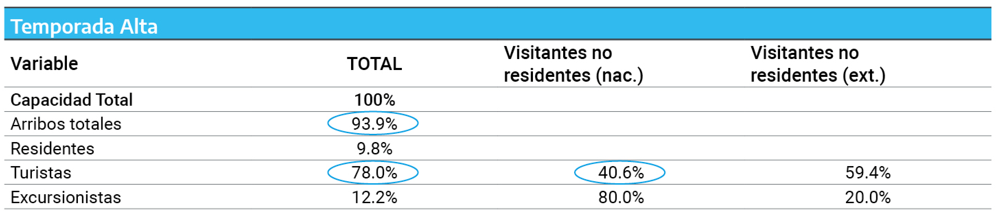
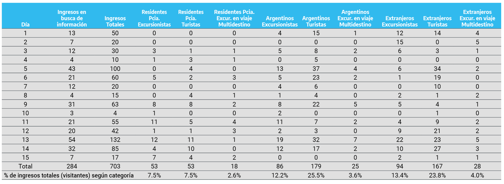

# **Algunos ejemplos**

De los datos provenientes de registros administrativos en estadística de turismo

A partir de las experiencias provinciales se presentan algunos ejemplos de abordaje metodológico para la elaboración y producción de estadística a partir datos que pueden obtenerse desde distintos `Registros Administrativos` .

En primer lugar, tal como se mencionó anteriormente, siempre que se trabaje con algún `Registros Administrativos` debe tenerse en cuenta cuál es la población objetivo a la cual éste hace referencia. Esto resulta importante, esencialmente, para los registros de entradas a atractivos turísticos (naturales, culturales y/o recreativos). Por ejemplo, si una provincia cuenta con cifras sobre tickets vendidos en un Parque Nacional, la oficina generadora de estadísticas del turismo debe tener presente que se está haciendo referencia sólo a los visitantes a dicho atractivo y no resultaría posible su expansión al total provincial de manera directa.

A su vez, si se cuenta con un registro sobre entradas y salidas por un acceso terrestre X, pero además en la provincia existen otros accesos de los cuales no se posee registro alguno, se deberá tener presente que en este caso tampoco se hace referencia a la totalidad de los visitantes en la provincia, sino a los "visitantes en la provincia que ingresan por el acceso terrestre X".

En general, se observa una escasa explotación de los múltiples registros existentes como fuente de información accesible en los diferentes niveles institucionales. Ello implica la necesidad de un proceso de concientización respecto a la utilidad y la disponibilidad de los mismos para la elaboración de estadísticas.

En los apartados subsiguientes, se proponen algunos esquemas de tratamiento de los `Registros Administrativos` , procurando identificar las particularidades, ventajas, limitaciones y la información que cada uno ofrece y que hacen que, en consecuencia, se deban diseñar e implementar alternativas metodológicas específicas de conversión de los datos registrados en información turística.

Resulta frecuente encontrar que las áreas destinadas a la producción de ET utilizan distintos `Registros Administrativos` favoreciendo cuantificar la evolución, el comportamiento y las perspectivas del sector Turismo. Sin embargo, se ha registrado cierta subexplotación de estos. A su vez, se puede advertir sobre posibles faltas de procedimientos metodológicos sólidos para el procesamiento de datos provenientes de los `Registros Administrativos` . Por ello, a continuación se presentan, a través de ejemplos, alternativas de tratamientos para la conversión de las unidades administrativas en datos estadísticos.

## Empresas de Peajes

Una de las principales fuentes secundarias de información en base a `Registros Administrativos` consiste en las empresas de peajes que se encuentran localizadas en diferentes puntos carreteros y vías de ingreso a las provincias, departamentos y/o municipios que resultan de gran utilidad como insumo para la elaboración de estadísticas de turismo. Cabe señalar que puestos de control vehicular (policiales, sanitarios) con registros continuos y rigurosos cumplen una función análoga a la de las estaciones de cobro de peaje.

Los datos suministrados por las firmas de peajes presentan limitaciones en su utilización directa como indicador estadístico de turismo, debido a que sólo contabilizan la cantidad de vehículos que pasan por un determinado punto. Por lo tanto, se requiere de una estrategia metodológica (proceso de conversión) específica para su utilización como insumo en la construcción de indicadores de turismo.

Acorde a la secuencia previamente presentada (en la Figura N° 2) suponiendo que la ubicación geográfica de un puesto de peaje es la vía de acceso a tres localidades distintas, A, B y C, y una de ellas requiere conocer cuál es la cantidad de arribos de visitantes, para lo cual solicita (y accede) a los `Registros Administrativos` del puesto de peaje.

La localidad ¨C¨ cuenta con mayor capacidad institucional para implementar un operativo in situ con el propósito de generar la información necesaria para elaborar coeficientes de distribución, que le permitan cuantificar efectivamente la cantidad de arribos de vehículos que ingresan a su localidad y, a la vez, relevar algunas variables que le permitan estimar la cantidad de visitantes, turistas y/o excursionistas.

Un elemento importante radica en que dicha localidad deberá generar una distribución específica, dentro del total de vehículos que pasaron por el puesto, para cuantificar la cantidad de vehículos que se dirigen a la misma y, posteriormente, cuantificar la cantidad de visitantes, sean turistas o excursionistas, que posean dicho destino.

Entonces, en primer lugar, se implementó una encuesta durante tres periodos: i) temporada alta (diciembre a marzo), ii) fines de semana largos y iii) fuera de temporada (abril a noviembre, excepto fines de semana largos), con el objetivo de lograr ajustar la estacionalidad, variable siempre fundamental en la medición del Turismo.

El muestreo fue aleatorio y sistemático (uno de cada X autos que pasaban por el puesto de peaje en el momento del relevamiento), con un tamaño de 600 casos para cada uno de los tres periodos. El universo contemplado fueron los automóviles y camionetas particulares (es decir, por ejemplo no se contemplaron los ómnibus). Las preguntas realizadas indagaron por la cantidad de personas por auto, el lugar de residencia habitual, el destino del viaje[^ejemplos-1] y la duración de la estadía en la localidad de destino.

[^ejemplos-1]: A los fines de no complejizar el ejercicio, se asume que todos los vehículos que cruzan el puesto de peaje se dirigen a una de las tres localidades contempladas

Los resultados de este estudio permitieron determinar, para cada uno de los tres periodos, el porcentaje de autos que arriba a cada localidad, el promedio de pasajeros por auto a cada localidad, para el total de pasajeros por localidad, la proporción de residentes y de visitantes, diferenciados en turistas (cuando pernoctan en el destino) y en excursionistas (cuando no pernoctan). Aplicando estos resultados a la totalidad de automóviles que cruzan en cada periodo el puesto de peaje (`Registros Administrativos` suministrado por la empresa), es posible estimar el total de visitantes (distinguiendo turistas y excursionistas) que arriban a cada una de las tres localidades por esta vía a lo largo de un año.

Por otro lado, se cuenta con información proporcionada por la empresa de peajes. Ésta informó que durante el año ingresó la siguiente cantidad de vehículos (automóviles y camionetas particulares) por el puesto:

-   Temporada alta (diciembre a marzo): 70.000

-   Fines de semana largo: 18.500

-   Resto del año (abril a noviembre excepto fines de semana largo): 35.000

La Figura N° 3.1 muestra los resultados del estudio, cuya obtención se detalla a continuación.

```{r estudioslocalidade, echo=FALSE, fig.cap="Resultados del estudio realizado por la localidad C" }

```

El primer paso, consistió en diferenciar la localidad de destino. De la encuesta implementada, 600 casos en total, se desprendió que 150 vehículos ($25\%$) fueron con destino a la localidad *A*, 210 ($35\%$) a la *B* y 240 ($40\%$) a la localidad *C*.

La cantidad promedio de pasajeros por vehículo a cada localidad, fue de 2,3 personas hacia *A* (345 personas en 150 vehículos), 3,0 personas hacia *B* y 4,0 personas hacia la localidad *C*. Este dato resulta relevante si es que se busca aplicar dichos coeficientes a futuras estimaciones. Para este punto resulta relevante tener presente las necesidades de actualización mencionadas en el primer capítulo.

Fuera de Temporada Alta (entre abril y noviembre, sin contar los fines de semana largos)del estudio implementado, se desprende que el $20\%$ fueron con destino a la localidad *A*, el $45\%$ a la *B* y el $35\%$ a la localidad *C*, con una cantidad promedio de pasajeros de 2,0 por vehículo hacia *A*, 2,5 hacia *B* y 3,0 hacia *C*.

Como se puede observar, la diferencia entre ambos periodos de temporada radica tanto en la proporción de vehículos que tiene como destino cada localidad (por ejemplo, a la localidad A se dirige el $25\%$ de los vehículos de temporada alta y el $45\%$ de los de fuera de temporada), como en la cantidad de pasajeros promedio por vehículo (siguiendo con la localidad A, 2,3 personas en temporada alta y 2,0 personas fuera de temporada).

La empresa informó un tránsito de 18.500 vehículos en todos los fines de semana largos del año, aunque el estudio se realizó en sólo uno de ellos[^ejemplos-2]. De la encuesta implementada, se desprende que 270 ($45\%$) fueron a la localidad *A*, 210 ($35\%$) a la *B* y 120 ($20\%$) a la *C* y con una cantidad promedio de 3 personas por vehículo hacia *A*, 4,0 hacia *B* y 2,5 personas hacia la localidad *C*.

[^ejemplos-2]: En este ejemplo se redujo a la existencia de un solo fin de semana largo, para evitar extender el razonamiento. Naturalmente, se deberá testear si hay o no diferencias sustanciales entre distintos fines de semana (por la época del año, por su extensión, etc.). para procurar registrar mejor la estacionalidad de los mismos.

En segundo lugar, respecto de la residencia habitual, en cada caso se consultó si era residente o no de la localidad a cuyo destino se dirigía, para poder determinar cuántas de esas personas eran visitantes. Se asumió que los visitantes cumplían con los requisitos de la definición de entorno habitual[^ejemplos-3] para diferenciarse de las personas con residencia local.

[^ejemplos-3]: El mismo se define como la zona geográfica (aunque no necesariamente contigua) en la que la persona realiza sus actividades cotidianas habituales (reside y trabaja). No existe una definición exacta del entorno habitual brindada por la OMT, razón por la cual se presentan diferencias entre los distintos países. Sin embargo, se debe tener en consideración que existen dos criterios claves para su definición: distancia y frecuencia. Es decir, si el individuo se desplaza a una zona geográfica de corta distancia al lugar de donde reside y/o trabaja o lo hace con una frecuencia alta, se considera que éste no ha salido de su entorno habitual. Distinto ocurre si el mismo se desplaza a una zona que se encuentra a una distancia larga o con una frecuencia baja. Por ejemplo, la Encuesta de Viajes y Turismo de los Hogares (EVyTH) define y operacionaliza el entorno habitual de un individuo que se encuentra conformado por: los lugares situados dentro de un determinado radio de la ciudad / localidad donde reside el individuo (Se consideraron 40 Km. para la región del Gran Buenos Aires -la Ciudad de Buenos Aires más los Partidos que forman parte del Conurbano Bonaerense- y 20 Km. para el resto del país), o los visitados una o más veces por semana por el mismo, aunque estén situados a una distancia mayor a la ya mencionada.

Por ejemplo, en la Temporada Alta, la cantidad total de visitantes que cruzaron por el peaje fue de 1.714 (sobre un total de 1.935 personas contabilizadas), de los cuales 290 tuvieron como destino la localidad *A* (266 turistas y 24 excursionistas -es decir, que no pernoctaron-) 599 la localidad *B* (562 turistas y 37 excursionistas), y por último, 825 a la localidad (760 turistas y 65 excursionistas).

Asimismo, el relevamiento que contempló el periodo fuera de Temporada Alta y de los fines de semana largos, contabilizó, en los 600 autos que participaron del estudio, de 590 visitantes(sobre 1.545 personas que viajaban en estos vehículos, lo que muestra la preponderancia de residentes que se cuentan en este periodo): 85 a la localidad A (65 turistas y 20 excursionistas), 260 a la localidad *B* ( 195 y 65 respectivamente), y por último, 245 visitantes a la localidad *C* (183 turistas y 62 excursionistas).

Por último, durante el fin de semana largo contemplado en el estudio, la cantidad total que surge del estudio sobre 600 vehículos arroja un total de 670 visitantes: 275 visitantes a la localidad *A* (185 turistas y 90 excursionistas), 310 a la localidad *B* (210 turistas y 100 excursionistas), y 85 a la localidad *C* ( 50 turistas y 35 excursionistas).

Es importante observar que los diferentes coeficientes de distribución elaborados varían en los tres periodos de tiempo considerados.

Una vez elaborados los coeficientes en base al estudio, estos se deben aplicar a la cantidad total de vehículos, informados por la empresa, que cruzaron el puesto de peaje en cada uno de los tres periodos considerados. De ese modo, se obtendrá el total de visitantes (turistas y excursionistas por separado) para cada una de las localidades (Figura 5A).

Como se podrá observar en la Figura 3.2, en la sabiendo que en la Temporada Alta el total de vehículos ingresados ha sido de 70.000 y que el $25\%$ se dirigió a la localidad *A*, $35\%$ a la localidad *B* y $40\%$ a la localidad *C*, se puede concluir que en dicho período los automóviles que las localidades recibieron fueron, 17.500 ($70.000$\*$25\%$), 24.500 ($70.000$\*$35\%$) y 28.000 ($70.000$\*$40\%$), respectivamente.

```{r coeficientes, echo=FALSE, fig.cap="Coeficientes del estudio realizado por la localidad C aplicados a los totales informados por la empresa de peaje" }

```

El hecho de realizar tres estudios (uno para cada periodo temporal) indudablemente implica una erogación mayor que realizar sólo uno. No obstante, sólo de esta manera es posible reflejar fielmente la realidad y, más aún, poder realizar estudios longitudinales (comparación de llegadas de visitantes en distintos años, por ejemplo), que suele ser un objetivo común de las estadísticas de turismo[^ejemplos-4].

[^ejemplos-4]: Si bien aquí no se entra en detalle sobre las cuestiones a tener en cuenta en el diseño de las muestras requeridas para los estudios planteados, pues el objetivo es llamar la atención sobre los procesos de construcción lógica de la información, en otros documentos elaborados en el marco del proyecto de Armonización de las Estadísticas de Turismo en las Provincias se desarrolla exhaustivamente, desde distintos ángulos, esta temática.

La Figura 3.3 permite comparar los resultados obtenidos más arriba con los que hubiesen surgido si se hubiese aplicado a las cantidades de vehículos de cada periodo los coeficientes correspondientes a la temporada alta.

```{r temporadaalta, echo=FALSE, fig.cap="Aplicación de coeficiente de Temporada Alta, obtenido del estudio realizado por la localidad C, a las cantidades de vehículos de todos los períodos (Temporada Alta, Fines de semana largo y Fuera de temporada)" }

```

\
Con estas dos Figuras se busca dar cuenta de la alteración que se produce en las estimaciones cuando no se toma en consideración la estacionalidad, mencionada en el primer capítulo. En este caso, si se aplica el coeficiente obtenido en temporada alta para todos los períodos, se estarían alterando las estimaciones de los períodos restantes. Por ejemplo, fuera de temporada, se sobreestimaría tanto los visitantes (en un $25\%$), como los turistas (en un $54\%$), mientras que los excursionistas sufrirías una subestimación del orden de un $62,8\%$. Esto ocurre debido a que en temporada alta, es mayor la cantidad de visitantes y turistas en relación al total de vehículos que ingresan, y más común el ingreso de turistas en relación a los otros dos períodos. Análogas a las alteraciones descriptas para fuera de temporada alta se producen en el período de fines de semana(los excursionistas se hubieran visto reducidos en un $-1,0\%$ y $-78,4\%$, respectivamente, y sólo la cantidad de turistas hubiera crecido en un $38,6\%$).

Como conclusión de este ejemplo, es evidente que resulta fundamental la evaluación previa y la implementación de una metodología adecuada que permita realizar de la manera más fiel posible el proceso de conversión de los datos provistos por el `Registros Administrativos` (automóviles en el ejemplo) a unidades relevantes desde el punto de vista de la estadística del turismo (cantidad de visitantes -turistas y excursionistas- según localidad de destino en el ejemplo).

## Terminales de pasajeros

\
Las terminales de autobuses, aéreas y/o ferroviarias ofrecen una importante fuente de información secundaria a las instituciones generadoras de estadísticas de turismo de las provincias y los municipios ya que registran las cifras de ingresos y egresos de servicios (ómnibus, aviones y ferrocarriles). Dicho registro presenta una gran robustez por ser de tipo censal, es decir, se registran todos los servicios que ingresen o egresen de la provincia, departamento y/o municipio[^ejemplos-5].

[^ejemplos-5]: Cabe señalar que esto puede no ser así en todos los casos. Por ejemplo, en las grandes ciudades suele ser común que en las terminales de ómnibus operen los servicios de "larga distancia", mientras que los servicios regionales lo hacen desde otros puntos. En un caso como el planteado, si no se contempla esta situación y se asume que todos los visitantes que ingresan en ómnibus llegan a la terminal, se estaría subestimando el peso del turismo interno, es decir, de los visitantes que provienen de otros puntos de la provincia (siempre y cuando, obviamente, estos puntos se encuentren situados por fuera de lo que se ha postulado como distancia mínima en la definición del entorno habitual). Tampoco suelen operar en las terminales de ómnibus los servicios tipo chárter. En cambio, en las terminales áreas y acuáticas es difícil que se presente este tipo de situaciones.

    \

Sin embargo, en general, estos `Registros Administrativos` no brindan información sobre los ingresos y egresos de personas, y, menos aún, si éstas resultan ser visitantes (turistas o excursionistas). En lo que a la identificación de visitantes y residentes corresponde, el dato sobre residencia juega un papel importante, ya que brinda una aproximación (los visitantes son un subtipo de viajero, determinado por haber salido de su entorno habitual).

Es en este último punto en el cual el procedimiento para la conversión de los datos suministrados por las terminales juega un rol fundamental. Si los datos son utilizados como indicadores en forma directa no sólo se estará perdiendo información sino que incluso se pueden extraer conclusiones erróneas: al tratarse de servicios públicos, la alteración en el flujo de ómnibus, trenes o aviones está sólo en parte sometida a variaciones de la demanda y, por otra parte, la proporción de residentes y visitantes en cada momento del año suele variar significativamente. Por tanto, es preciso implementar una estrategia metodológica adecuada para obtener información relevante desde el punto de vista de las estadísticas del turismo. En otras palabras, mientras que este tipo de `Registros Administrativos` brinda información desde el punto de vista de la oferta, sólo con un proceso de reconversión metodológica se podrá arribar a información sobre la demanda turística.

Siguiendo la línea de lo presentado anteriormente, en primer lugar se deberá definir la población objetivo, cuyo reconocimiento resulta fundamental como guía para los pasos subsiguientes del análisis. En este caso, la población objetivo serán los visitantes (turistas y excursionistas) que ingresen por alguna de las vías mencionadas (autobús, aérea o ferrocarril).

Una vez delimitada la población objetivo, se deben definir e identificar tanto las unidades que informará el `Registros Administrativos` en cuestión como los pasos requeridos para la obtención de la información estadística y su delimitación (tipo de servicio de transporte, alcance geográfico, periodos a considerar en el estudio, etc.).

A continuación se presenta, un ejemplo, como propuesta para el tratamiento y procesamiento de los datos provenientes de estas fuentes secundarias.

La localidad "Norte" posee un aeropuerto al que llegan tres vuelos diarios, los cuales cuentan con una capacidad total de 104 asientos por vuelo (312 diarios). Si bien se cuenta con una precisa contabilización de la oferta -llegadas y salidas- de servicios, se desconoce la cantidad de personas que ingresan, así como también la residencia de las mismas.

En primer lugar se deberá elaborar un coeficiente que permita determinar la cantidad de pasajeros que ingresan en los vuelos, y en segundo lugar, una distribución del lugar de residencia para poder clasificar a los pasajeros en "visitantes" y "otros viajeros"[^ejemplos-6], teniendo en consideración la definición de entorno habitual. Por tanto, se deberá realizar un operativo que permita determinar un coeficiente mediante el cual se logre estimar la cantidad de pasajeros y que proporción corresponde a cada uno de los grupos mencionados, distinguiendo a los visitantes entre turistas y excursionistas.

[^ejemplos-6]: Toda persona que se desplace fuera de su entorno habitual por una duración mayor a doce meses o cuya finalidad primordial es ejercer una actividad remunerada en el lugar visitado. Dentro de este grupo se encuentran: emigrantes, trabajadores transfronterizos, viajeros en desplazamiento cotidiano al lugar de trabajo, diplomáticos y militares, refugiados, viajeros en tránsito.

A fin de realizar el estudio propuesto y dotarlo de robustez, se han determinado, como en el ejemplo de la sección anterior, tres períodos de estudio: "temporada alta", la cual posee una duración total de dos meses; "fuera de temporada", la que alcanza en total los nueve meses; y "fines de semana largo", los cuales sumados ascienden a 30 días, es decir un mes.

A continuación se calculan los asientos totales correspondiente a cada período en análisis, recordando que los tres vuelos diarios implicaban 312 asientos y simplificando la extensión de todos los meses a 30 días[^ejemplos-7]:

[^ejemplos-7]: En el ejemplo se asume que no se suspenderá ni agregará ningún vuelo a lo previsto. No obstante, si esto sucediera no sería ningún problema, pues solo habría que sustraer o adicionar asientos a la capacidad máxima disponible.

-   Temporada alta: 18.720 asientos (312 asientos diarios\*30días\*2meses)

-   Fines de semana largo: 9.360 asientos (312 asientos diarios\*30 días)

-   Fuera de temporada: 84.240 asientos (312 asientos diarios\*30 días\*9 meses)

Una vez determinada la capacidad máxima, se realiza un estudio que toma muestras independientes para cada período en análisis, a fin de poder dar cuenta de la heterogeneidad temporal de la afluencia turística al destino.

Además, estas muestras se construyen de maneras diversas, procurando que sean representativas de la variedad de situaciones al interior de cada periodo. En el caso de "temporada alta" y "fuera de temporada", las mismas estarán conformadas por siete días distintos (lunes, martes, etc.) de semanas diferentes de cada una. Para los "fines de semana largo" la muestra comprende a cuatro días, también distintos, cada uno tomado de fines de semana largo con distintas características. Por tanto, debido a los datos mencionados anteriormente, se puede dar cuenta de los lugares totales que se contemplan en el estudio por temporada. Los mismos se enuncian a continuación:

-   **Temporada alta:** 2.184 (312 asientos \* 7 días)

-   **Fuera de temporada:** 2.184 (312 asientos \* 7 días)

-   **Fines de semana largo:** 1.248 (312 asientos \* 4 días)

\
Se busca eliminar cualquier tipo de sesgo que se pueda generar por las grandes fluctuaciones que presenta el sector turístico (cuestiones económicas, climáticas, etc.). Es decir, por ejemplo, si se tomaran todos los días de una misma semana en la que se presentan condiciones meteorológicas muy desfavorables y eso se tomara como representativo de toda la semana, probablemente se distorsionaría el valor del coeficiente y, con ello, de la cantidad estimada a posteriori. En otro orden, si el estudio se realiza en semanas distintas, pero siempre el mismo día (por ejemplo, los sábados), también se podrían introducir sesgos si la demanda del destino presenta alguna particularidad bajo la cual en determinados días es más fuerte que en otros. Para evitar este tipo de distorsiones, los días en los que se realizará el estudio son seleccionados al azar (por sorteo) previamente.

El estudio contempla dos fases o dos tipos de relevamientos. Por un lado, se realiza un conteo de llegadas de pasajeros (esta tarea puede no ser necesaria, por ejemplo, si la empresa informa la cantidad de pasajeros embarcados); y por el otro, una pequeña encuesta a todos los pasajeros que arriban[^ejemplos-8] a fin de determinar si son residentes[^ejemplos-9] o visitantes. En este último caso, se indaga sobre su lugar residencia (para diferenciar a los residentes en el país de quienes lo hacen en el exterior) y la duración prevista de la estadía (para clasificarlos en turistas o excursionistas).

[^ejemplos-8]: En la práctica es casi imposible encuestar a todos los pasajeros en un estudio de este tipo, pues exige un enorme operativo de campo de muy corta duración, es decir, algo sumamente ineficiente. Para simplificar el razonamiento, aquí se postula que se encuesta a todos los que arriben en los vuelos estudiados. Debe considerarse que, en la práctica, los casos a encuestar deben ser seleccionados mediante un método que garantice la aleatoriedad, es decir, que no imponga un sesgo, como por ejemplo, encuestar a quienes "parezcan extranjeros".

[^ejemplos-9]: Si bien este ejercicio apunta a cuantificar y caracterizar a los visitantes que llegan al destino, cabe notar que del mismo estudio podría surgir una estimación acerca del turismo emisivo, es decir, de los residentes en ese lugar que viajan a otros destinos.

Los resultados obtenidos son los que describen en la siguiente figura:

```{r resultadosobtenidos, echo=FALSE, fig.cap="Resultados obtenidos por los estudios muestrales realizados por la localidad Norte" }

```

Si se encuesta a todas las personas que ingresen vía alguno de los aviones diarios se busca determinar, en primer lugar, el porcentaje de cantidad de llegadas sobre el total.

Si cada avión posee 104 asientos y diariamente hay tres llegadas, en los siete días contemplados para el estudio de temporada alta, la oferta de asientos (pasajes) alcanza a 2.184 asientos (104 x 3 x 7).

Si en el estudio realizado en 7 días de temporada alta se han contado un total de 2.050 llegadas de pasajeros, ello implica una tasa de ocupación del $93,9\%$ sobre el máximo disponible (2.050 llegadas efectivas / 2.184 asientos disponibles).

Fuera de temporada los arribos alcanzaron un total de 1.150 pasajeros, lo que implica una ocupación del $52,7\%$ del total de asientos disponibles.

Por último, en fines de semana largo, el relevamiento se realizó en 4 días (1.248 asientos) contándose 950 llegadas ($76,1\%$ de ocupación de asientos).

Con estos resultados es posible estimar el total de pasajeros arribados al aeropuerto durante el año considerado, al aplicar la tasa de ocupación de cada periodo al total de asientos disponibles en cada uno de ellos.

La segunda fase es la aplicación de una encuesta muy simple a todos los pasajeros arribados para determinar, como se mencionó anteriormente, lugar de residencia y estadía en el destino (para el caso de los visitantes).

En el operativo realizado para temporada alta se da cuenta de que ingresaron un $9,8\%$ de residentes y un $90,2\%$ de visitantes ($78\%$ de turistas y $12,2\%$ de excursionistas). Un $40,6\%$ de los turistas eran no residentes en Argentina y un $59,4\%$ correspondieron a no residentes extranjeros; en el caso de los excursionistas, estas proporciones alcanzaron respectivamente al $80\%$ y $20\%$.

Para obtener los coeficientes correspondientes que cada categoría ocupa sobre la capacidad total, que servirá para realizar las estimaciones anuales, se presenta un ejemplo en el cuadro subsiguiente (Figura 3.5). En el mismo, se ejemplifica para temporada alta el caso de estimación de coeficientes de "arribos de turistas no residentes (nac.)" sobre la capacidad total. Los valores que deben ser multiplicados son provenientes de la Figura 3.4, es decir, del estudio realizado.

```{r arribosdeturistas, echo=FALSE, fig.cap="Estimación de coeficiente de arribos de turistas residentes sobre capacidad total" }

```

Las estimaciones se obtienen a partir de multiplicar los porcentajes remarcados en la Figura 3.5 de la siguiente manera:\

1.  Multiplicar el porcentaje de "arribos totales" con el de "turistas" ($0,94$\*$0,78$=$0,7332$), para así obtener el peso de los turistas que han ingresado a la localidad "Norte" sobre el total de asientos disponibles ("capacidad total").

2.  Una vez obtenido dicho valor, se lo debe multiplicar por el porcentaje que corresponde a los "visitantes no residentes (nac.)" (esto es, el porcentaje de no residentes nacionales en total de turistas), a fin de obtener el peso de los turistas no residentes (nac.)que han ingresado sobre el total asientos o pasajes disponibles ($0,7332$\*$0,41$=$0,2976792$). En efecto, se puede concluir que un **29,8% de los asientos disponibles en los vuelos arribados durante la temporada alta han sido ocupados por turistas no residentes provenientes de otras localidades o provincias del país**.

3.  Finalmente, para estimar la cantidad de visitantes en el periodo bajo estudio se debe multiplicar el coeficiente de cada celda por el total de asientos disponibles en el periodo. Si la temporada alta está comprendida por 2 meses, ello implica un total de 18.720 asientos disponibles. Si se estimó que el porcentaje de éstos ocupados por turistas no residentes alcanzaba al $29,8\%$, ello implica una cantidad que alcanza a 5.567 turistas ($0,298$\*$18.720$).

El mismo cálculo debe ser realizado para los casos subsiguientes, de modo de poder estimar, a partir de los datos del `Registros Administrativos` y los coeficientes construidos, la cantidad de visitantes por tipo y lugar de residencia para el año entero.

En términos lógicos, sólo es preciso estimar, para cada periodo definido, el coeficiente que corresponde a cada una de estas cuatro categorías: (1) turistas no residentes nacionales, (2) turistas no residentes extranjeros, (3) excursionistas no residentes nacionales y (4) excursionistas no residentes extranjeros. La suma de las cuatro arroja un coeficiente que permite estimar el total de visitantes a partir de las plazas disponibles. La suma de 1 y 2, arroja el coeficiente del peso de los turistas (análogamente, 3+4= excursionistas) y la suma de 1 y 3 la de visitantes no residentes nacionales (análogamente, 2+4= visitantes no residentes extranjeros).

La Figura 3.6 da cuenta, en primer lugar, de los coeficientes para los grupos estratos de visitantes considerados por periodo (calculados como en el ejemplo de la Figura 3.5); luego, aplicando estos valores sobre la cantidad de asientos disponibles (capacidad total) en cada periodo, se obtienen las cantidades de visitantes correspondientes por categoría. Por ejemplo, si para la temporada alta, la llegada de turistas no residentes nacionales ocupó un $29,8\%$, ese porcentaje es multiplicado por la capacidad total de asientos en dicho período (en este caso: 18.720), para así obtener la cantidad estimada de llegadas en un año durante la temporada alta.

```{r llegadasportipo, echo=FALSE, fig.cap="Estimación de llegadas por tipo y residencia de visitante en cada período bajo estudio" }
knitr::include_graphics('imagenes/figura08.png')
```

Es importante remarcar el hecho de que los coeficientes varían en forma significativa en cada uno de los períodos tomados en consideración. Como en el ejemplo anterior, de haberse aplicado un coeficiente único que no contemple las fluctuaciones estacionales, se hubiese perdido muchísima información y se hubieran introducido sesgos que, posiblemente, invalidarían las estimaciones.

Por otro lado, debido a la variabilidad que caracteriza a la demanda turística, se debe tener en cuenta que los resultados obtenidos deberán ser actualizados cada cierto tiempo a fin de reflejar del modo más fehaciente la realidad del sector. Si es preciso realizar un estudio para el cálculo de los coeficientes de conversión todos los años, cada tres o cada cinco años, etc., dependerá de las características del destino, del nivel de estabilidad de la demanda, del grado de precisión buscado, de los objetivo finales para los cuales se procura obtener la información, etc.

## Centro de Información

Tomando en consideración a otro de los `Registros Administrativos` que permite construir datos que den cuenta de la Demanda Turística, como ser los registros de llegadas a los CIT, el procedimiento de utilización que se propone es el siguiente.

En primer lugar, identificar a la población objetivo: los visitantes (tanto turistas como excursionistas) que vayan a solicitar información a los CIT[^ejemplos-10]. Luego, se deberá determinar el alcance geográfico (provincia, municipio, etc.) y temporal del estudio.

[^ejemplos-10]: Es decir, no será el universo de visitantes en la provincia, departamento y/o municipio lo que se estará estudiando, sino un subconjunto de éstos. Por otro lado, no es poco usual que residentes en un destino se acerquen a un CIT en búsqueda de información. No obstante tal situación no se contempla aquí para no complejizar el ejemplo.

    \

Seguidamente se presenta un ejemplo propuesto siguiendo los pasos mencionados. En la localidad "X" se posee un único CIT que funciona en temporada alta (3 meses) y registra en forma diaria la cantidad de individuos que ingresan a consultar información ("consultas atendidas").

Para poder obtener a partir de este dato información sobre el total de visitantes, y su distribución por tipo y residencia, se realiza un relevamiento especial en 15 días sorteados al azar (cuidando las proporciones entre días hábiles y no hábiles) indagando a todos los que ingresen en esos días por las siguientes variables:

-   **Cantidad de individuos** que ingresan en busca de información.

-   **Cantidad de ingresos totales**: corresponde a la suma de los integrantes de los grupos de viaje de quienes se acercan a buscar información.

-   **Origen**: residentes de otra localidad de la provincia/argentinos de otras provincias/extranjeros.

-   **Tipo de visitante**: turista, excursionista o excursionista que es turista en otro destino[^ejemplos-11].

[^ejemplos-11]: Esta categoría hace referencia a aquellos visitantes que se encuentran realizando un viaje multidestino como turistas, pero que visitan a la localidad en calidad de excursionistas. Es decir, si bien pernoctan fuera de su entorno habitual, no lo hacen en la localidad que se encuentra bajo estudio, en la cual se quedan menos de un día.

Los resultados informados son los que se exponen a continuación, en la Figura 3.7

```{r cantidaddevisitantes, echo=FALSE, fig.cap="Cantidad de visitantes por categoría informados por el CIT y cálculo de porcentaje que los mismos ocupan sobre el total de ingresos" }

```

Figura 3.7. Cantidad de visitantes por categoría informados por el CIT y cálculo de porcentaje que los mismos ocupan sobre el total de ingresos.

Con los datos relevados, el instituto generador de estadísticas de la localidad procede a determinar el porcentaje de visitantes que ingresan en busca de información al CIT según categoría. En el caso de los excursionistas, un $7,54\%$ son residentes de otras localidades de la provincia, un $12,2\%$ nacionales y un $13,4\%$ extranjeros. Entre los turistas que ingresaron al CIT se cuenta con un $7,5\%$, un $25,5\%$ y un $23,8\%$, respectivamente. Por último, aquellos excursionistas que son turistas en un viaje multidestino, un $2,6\%$ de éstos pertenecen a otras localidades de la misma provincia, un $3,6\%$ a otras provincias del país y un $4,0\%$ a otros países.

Resulta relevante destacar que estos porcentajes han sido calculados sobre el total de visitantes (suma de integrantes de los grupos de viajes que, mediante uno de sus componentes, se dirigieron al CIT), y no de los ingresos al CIT de las personas, consideradas individualmente, que en busca de información, a fin de poseer una visión con mayor exactitud sobre la realidad del sector turístico.

A partir de los datos sobre cantidad de consultas atendidas y de los coeficientes obtenidos en el estudio ad hoc, se podrá estimar las cantidades de visitantes de cada categoría que ingresan a los CIT en el total de la temporada.

Como ya se mencionó en ejemplos anteriores, se debe tener en consideración que cuando se elaboran coeficientes de estimación, éstos deben ser actualizados cada cierto período de tiempo y modificados a raíz del componente estacional que el sector turístico presenta. Es decir, se deberá contar con distintos coeficientes para cada tipo de momento turístico, por ejemplo: uno para "temporada alta" y otro para "temporada baja"; así como también, actualizar éstos cada dos o tres años a fin de reflejar la variabilidad que se puede presentar en la afluencia turística. En el caso de que los coeficientes se mantengan constantes, sólo podría serlo producto de que mediante sucesivas instancias de testeo no se generen variaciones que requieran modificaciones de éstos.

Por otra parte, si la localidad en cuestión cuenta con una encuesta de perfil dirigida a los visitantes, en la misma se puede agregar una pregunta a fin de indagar si éstos han concurrido o no en busca de información a los CIT.

Así, si del estudio se desprende que durante la temporada surge que hubo 1.500 visitantes que pasaron (ellos u otros integrantes de su grupo) por el CIT y en otra encuesta surge que el 25% de los visitantes concurrieron al CIT es posible estimar el volumen total de visitantes en la temporada, mediante una sencilla regla de tres simple: si los 1.500 visitantes que pasaron por CIT representan al $25\%$ de los visitantes de un destino, el total de visitantes al mismo fue de 6.000.

Más allá de este ejemplo, la cobertura de este tipo de `Registros Administrativos` puede variar de destino y destino, y conviene siempre tener presente la población objetivo que se está estudiando. Es decir, no sólo no es posible con los datos obtenidos de este `Registros Administrativos` y el procedimiento ad hoc estimar la cantidad total de visitantes que ingresaron a la localidad "X" durante cierto período, sino que tampoco se podrán hacer generalizaciones (más allá del propio universo de visitantes al CIT) sobre sus características, por ejemplo: el tipo de visitante o, el lugar de residencia, que muy probablemente diferirán entre los visitantes que pasan por el CIT y los que no lo hacen.

A su vez, si bien el relevamiento se ejecuta en forma diaria, realizar un estudio con esa frecuencia no tendría sentido en términos estadísticos (la estadística sugiere períodos de análisis); por lo tanto sería pertinente determinar el período de análisis (semanal, quincenal, mensual, etc.). Incluso, ante fines de semana largos y/o semanas festivas significativas en términos turísticos para dicha localidad que merezca relevancia de ser estudiada.

Asimismo, para la cuantificación de otras variables como son la cantidad de pernoctes, el gasto realizado (sea diario, promedio, total, etc.), lugares visitados, etc. se deberá contar con la información desagregada al igual que el tipo de nacionalidad, para que, posteriormente se puedan elaborar estadísticas similares. Es decir, si el CIT cuenta con una encuesta, se deberán agregar preguntas que indaguen sobre dichas cuestiones a fin de poder estudiarlas tal como en el caso ejemplificado.

Por otro lado, en el caso en que no se pueda llevar a cabo, en forma continua, una encuesta que indague sobre las variables mencionadas anteriormente, se deberá estudiar la posibilidad de implementar un operativo alternativo que permita estimarlas. Uno de ellos es ejecutar una encuesta, dentro del CIT, en determinados períodos muestrales a fin de poder calcular coeficientes y/o fórmulas que permitan estimar dichas dimensiones[^ejemplos-12]. Éste sería un método correcto de estimación, pero se deben tener en cuenta algunas aclaraciones y/o recomendaciones metodológicas para proceder.\
\
\
\

[^ejemplos-12]: Para mayor detalle ver ejemplo de la sección Terminales de Pasajeros (Ómnibus, Aéreas y/o Ferroviarias)
